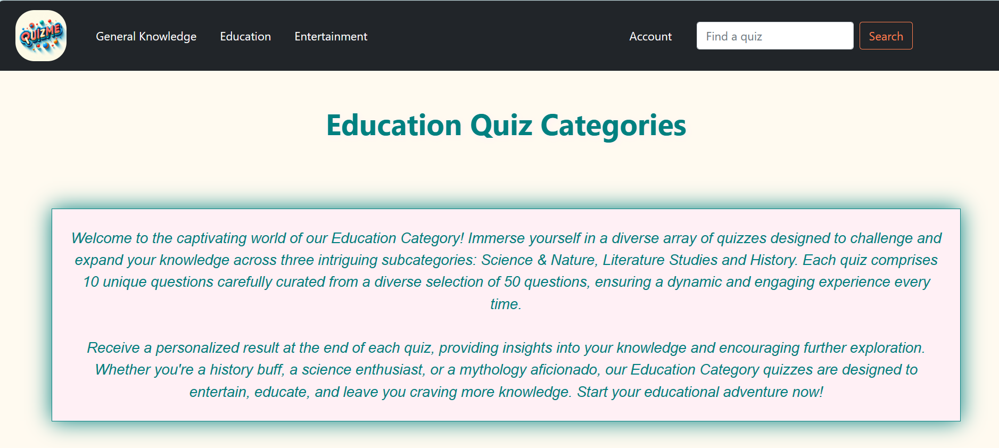
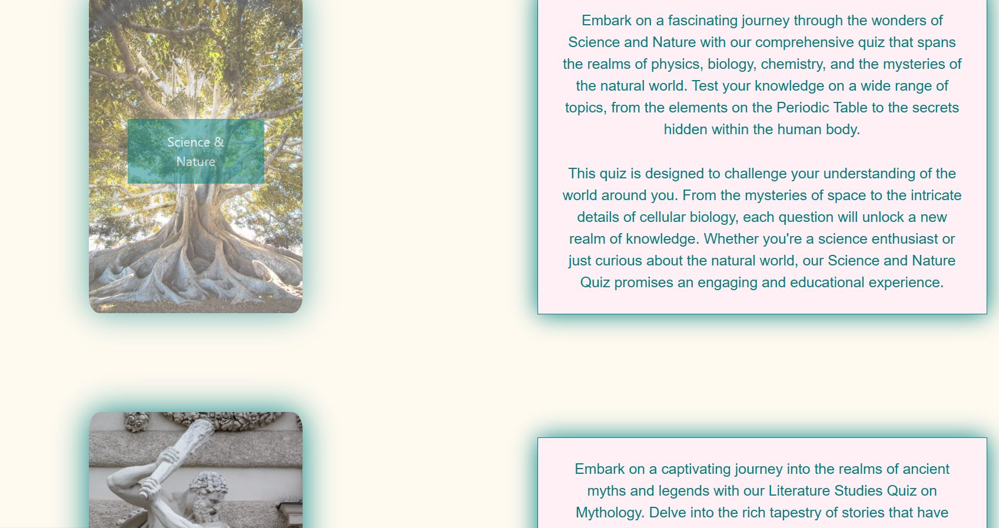
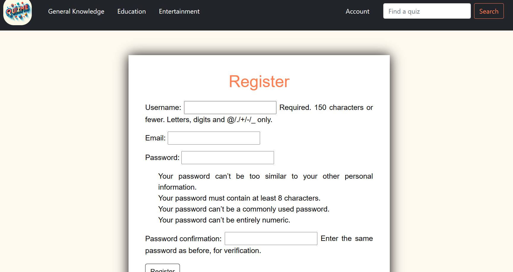
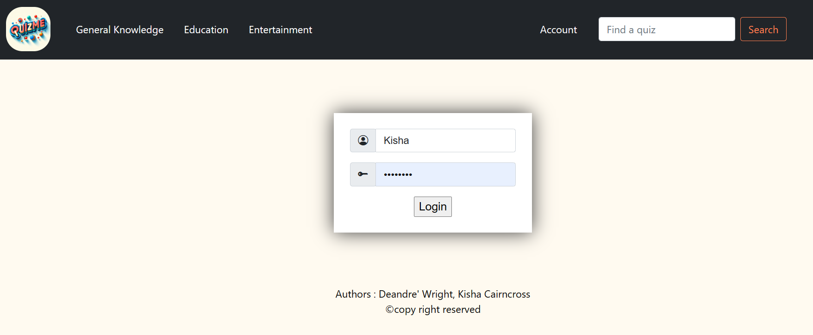
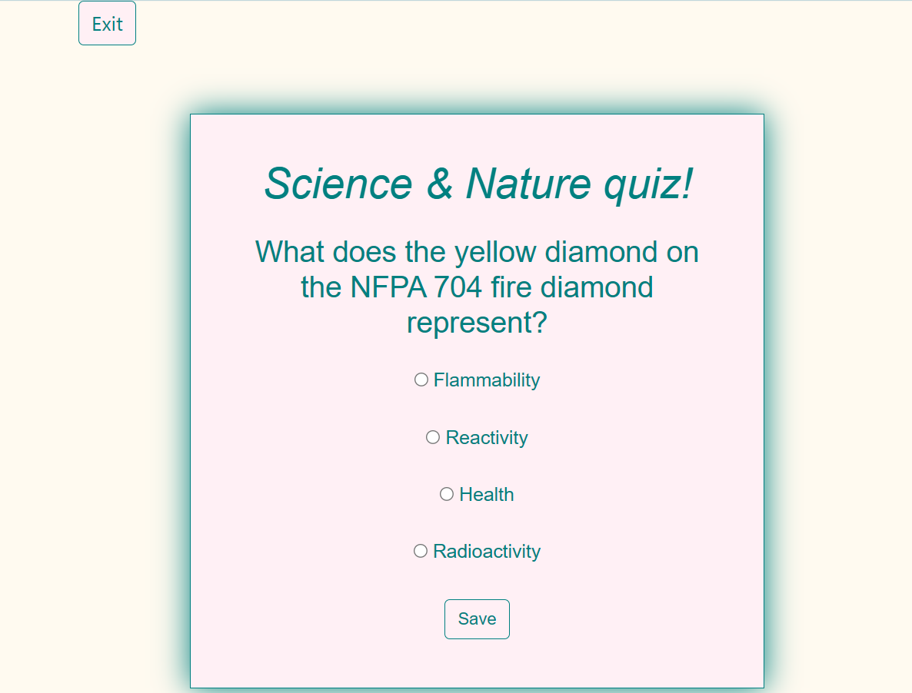
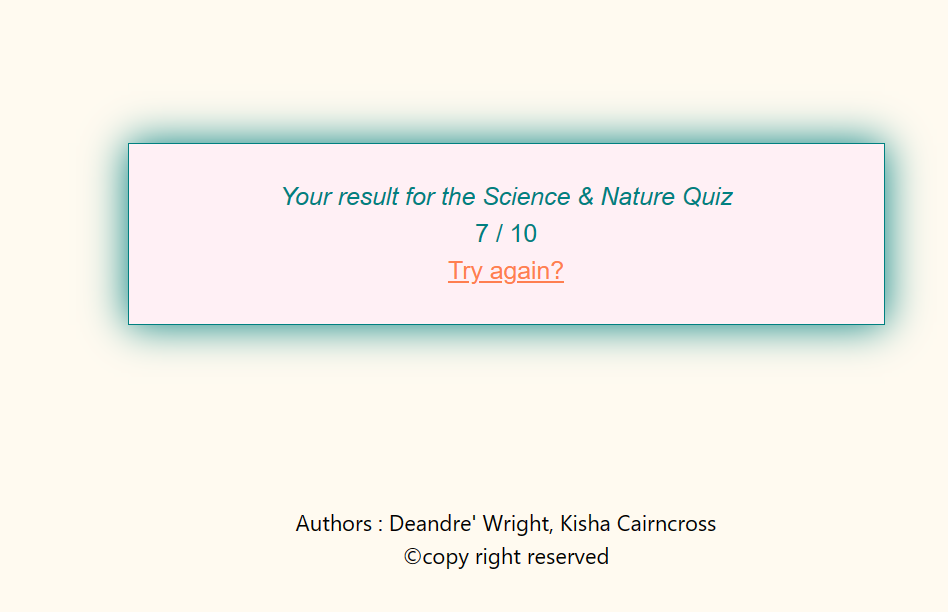

# Project name
QuizMe

# Project description

*Importance of the project*
A Django website for a magazine providing quizzes for General Knowledge, Education and Entertainment. It is Dockerised, hosted on AWS and uses an API.

The QuizMe project holds significant importance in today's digital age where traditional print media is declining, and people, including students, are increasingly spending more time on digital platforms. The project aims to bridge the gap between education and entertainment by providing accessible and engaging quizzes to the general public.

1. **Educational Impact**: By offering quizzes on various subjects and topics, QuizMe contributes to the educational landscape by providing a platform for users to test their knowledge and learn new information in an interactive manner. This aligns with the modern trend of digital learning and complements traditional educational methods.

2. **Engagement and Entertainment**: Quizzes are inherently engaging and entertaining, making learning more enjoyable for users. By incorporating elements of gamification, QuizMe encourages users to actively participate in the learning process, leading to increased retention of information and sustained engagement with the platform.

3. **Accessibility and Reach**: The online nature of QuizMe ensures that it is accessible to a wide audience, including students, professionals, and individuals seeking leisure activities. As long as users have access to the internet, they can benefit from the quizzes offered by the platform, regardless of their geographical location or background.

4. **Personalised Learning Experience**: Through the creation of user accounts, QuizMe can tailor quizzes to individual preferences and learning goals. This personalised approach enhances the learning experience by providing relevant content and allowing users to track their progress over time, thereby facilitating continuous improvement.

5. **Contribution to Digital Literacy**: By encouraging users to engage with digital platforms for educational purposes, QuizMe contributes to the development of digital literacy skills. Users learn to navigate online interfaces, interact with digital content, and utilise technology for learning and self-improvement.

Overall, the QuizMe project serves as a valuable resource for lifelong learning, entertainment, and skill development in an increasingly digital world. By offering engaging quizzes and fostering a culture of curiosity and exploration, QuizMe aims to empower users to expand their knowledge and reach their full potential.

*What the project does*

The QuizMe project functions as an online platform that facilitates the creation, administration, and participation in quizzes across various categories. Here's an overview of what the project does:

1. **Quiz Creation and Administration**: The project allows quiz masters to define quizzes by curating sets of prompts with corresponding options. These quizzes are stored in the database and can be managed by the quiz master through an admin interface.

2. **Quiz Data Source**: QuizMe leverages the Open Trivia Database (OTDB) API to source quiz data. This ensures a diverse range of quiz topics and questions, enhancing the variety and quality of quizzes available on the platform.

3. **Assessment and Scoring**: Users can attempt quizzes provided by the platform, with each prompt serving as an assessment of their knowledge or skills in a particular area. Upon completion, users receive scores generated by the quiz master based on their performance.

4. **Access Control**: Initially, unrestricted quizzes are available for public access on the website, serving as a gateway for users to explore the platform. However, to attempt quizzes beyond the general knowledge category, users are required to sign up for an account.

5. **User Registration and Account Management**: Upon signing up, users gain access to a broader range of quizzes across different categories. New account holders receive confirmation emails after registering, ensuring a seamless onboarding process.

6. **Categorisation of Quizzes**: Quizzes are organised into distinct categories such as Education, General Knowledge, and Entertainment, each containing its own subcategories. This categorisation helps users easily navigate and discover quizzes relevant to their interests.

Overall, QuizMe offers a comprehensive and user-friendly platform for both quiz masters and participants, fostering engagement, learning, and entertainment through quizzes tailored to diverse interests and preferences.

# Installation section
*Tell other users how to install your project locally*

Outline the steps necessary to build and run your application with venv and Docker:

1. Open the Command Prompt
1. Create a Virtual Environment:
    + in Command Prompt (powershell)
    + create a folder for new virtual env: mkdir Virtual_env
    + cd Virtual_env
    + create virtual env: virtualenv quizme_venv
    + you will see Scripts in quizme_venv
    + change to Command Prompt (admin) 
    
1. Activate the Virtual Environment:
    + On Windows (Command Prompt):
        + cd to path to Scripts "C:\Users\path\to\Scripts"
        + activate.bat
   
1. Download Python to run the program @ https://www.python.org/downloads/
1. Run the Python Installer
1. Check the Box for "Add Python to PATH"
In cmd:
1. Verify pip installation: `pip --version`

*Note: Django Secret Key and Database Admin login is in the .env*
You will need to set up your custom Secret Key before running the website
1. Clone this repository
1. Create a `.env` file in the project's root directory with the following content:
    + DJANGO_SECRET_KEY=mysecretkeygoeshere
1. Install Packages:
    + pip install [package_name]
    
    OR
    + python -m pip install -r requirements.txt

# Usage section
*Instruct others on how to use your project after they’ve installed it*

In the Command Prompt:
+ cd to project root directory and run the command: python manage.py runserver

The docker image can be found at: 
+ (*enter url here*)

Outline the steps necessary to build and run your application with venv and Docker:
+ Install Docker desktop @ https://www.docker.com/products/docker-desktop
+ Open the Command Prompt
    Follow the commands:
    + docker run hello-world
    + docker build -t quizme . (Notice the '/' left off at the end)    
    + docker run -d -p 80:80 quizme    
    + docker tag quizme [user]]/[repo]]:[tag-name]
    + docker login
    + docker push [user]]/[repo]]:[tag-name]
    + docker run -d -p 80:80 [user]]/[repo]]

1. Deactivate the Virtual Environment:
    + deactivate

*View user-friendly software documentation generated with Sphinx*

+ locate the HTML file in the _build/html folder
+ open index.html file in a browser

*Include screenshots of your project in action*

# Credits
*Highlights and links to the authors of your project if the project has been created by more than one person*

@KC-software-en https://github.com/KC-software-en

@Deandre1dev https://github.com/Deandre1dev

# Add a URL to your GitHub repository
https://github.com/KC-software-en/QuizMe

# Add a url to the QuizMe website
*paste link here*